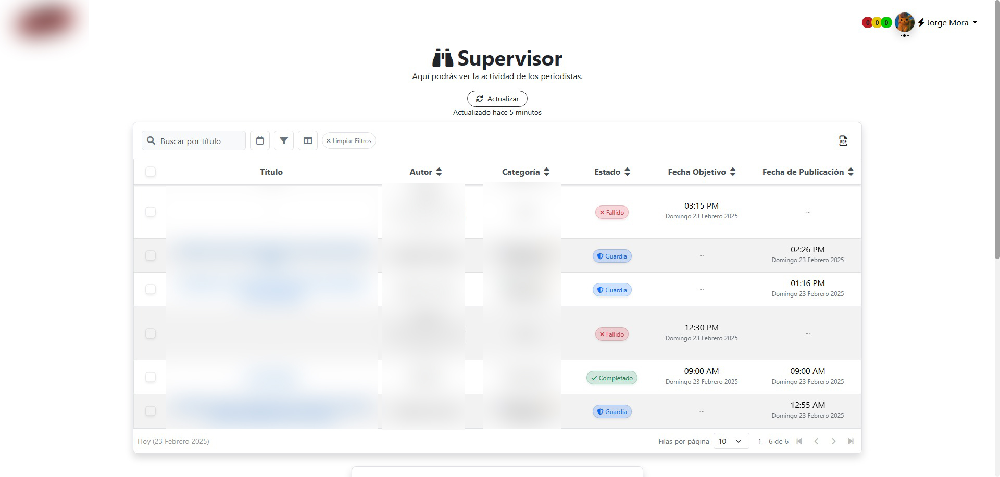

A **web platform** designed to **manage news, track employee activities, and handle company and staff information** for a radio station.  

## 🚀 Features  

### 🔄 Auto-Updater & Changelog  
- **GitHub Actions Integration**: Automatically updates the platform on new commits.  
- **Changelog Parser**: Extracts commit messages and displays updates in a dedicated section.  

### 🌴 Vacation Management  
- Calculates **available vacation days** based on **Mexican Federal Labor Law**.  
- Allows employees to **request vacations** and even **advance them** if needed.  

### 🎥 Live Monitoring  
- **Tracks live Facebook broadcasts** to monitor journalist activity in real-time.  

### 🔔 Advanced Notifications System  
- **Personalized notifications** for employees.  
- **Push notifications** via **Firebase**, allowing users to receive alerts on multiple devices.  

### 🕵️‍♂️ Supervisor Dashboard  
- Tracks **journalist activities** on the **WordPress news portal**.  
- Dynamically compares scheduled working hours, detecting **delays** and **extra work**.  

### 📋 Task Management  
- **Daily task assignment system** for employees.  
- Allows setting **detailed task parameters** for each worker.  

### ⛅ Automated Weather Reports  
- **Client-side data processing** for weather reports.  
- Uses **Puppeteer** to **automatically generate weather images**.  
- Scheduled **automatic weather updates** on the station’s **Facebook page**.  

## 🛠️ Additional Features  
- **Profile Image Selection & Upload**.  
- **Personalized Welcome Hub** displaying **daily tasks & greetings**.  
- **News Aggregator** to keep track of news from other municipalities.  
- **Robust News Script Management** for daily radio broadcasts.  
- **Crime Map** to maintain a historical record of criminal incidents.  
- **Employee Data Management** for organizing personal & professional records.  