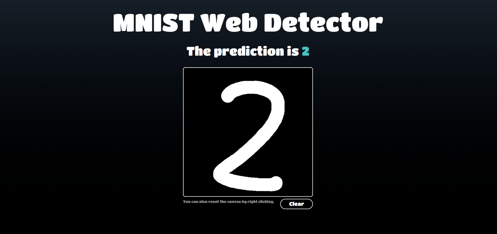

An interactive web application for real-time handwritten digit recognition using Convolutional Neural Networks (CNN) with PyTorch.



## 🎯 Key Features

- **Real-Time Recognition**: Draw digits on a canvas and get instant predictions every 200ms 
- **Dynamic Training**: Train CNN models with live progress visualization
- **Dual WebSocket Architecture**: Separate prediction and training progress for concurrent operations
- **GPU Support**: CUDA acceleration for model training 
- **Model Persistence**: Automatic saving of weights and training metadata 
- **Hot Reload**: Development with automatic reload in frontend and backend

## 🚀 Quick Start

### Prerequisites

- Docker and Docker Compose
- NVIDIA Docker (optional, for GPU acceleration)

### Installation

1. **Clone the repository**:
```bash
git clone https://github.com/moraxh/MNISTWebDetector.git
cd MNISTWebDetector
```

2. **Start services**:
```bash
docker-compose up --build
```

3. **Access the application**:
   - Frontend: http://localhost:3000
   - Training WebSocket: ws://localhost:5001
   - Prediction WebSocket: ws://localhost:5002

## 🎨 Application Usage

### Digit Recognition

1. Draw a digit on the canvas using your mouse
2. Predictions appear automatically every 200ms while drawing
3. Use the "Clear" button to erase the canvas

### Model Training

1. Click "Train Model" to start training
2. Watch real-time progress with loss graphs
3. Model saves automatically upon training completion

### Frontend Container
- Based on node:22-alpine
- Port: 3000
- Hot reload with mounted volumes

### Backend Container
- Based on pytorch/pytorch:2.6.0-cuda11.8
- Ports: 5001, 5002
- GPU support with NVIDIA Docker
- Auto-restart with watchmedo

## 🧠 Model Architecture

### CNN (Convolutional Neural Network)
- **Convolutional Layers**: 2 layers (32, 64 filters)
- **Pooling**: MaxPool2d (2x2)
- **Dropout**: 0.25 for regularization
- **Dense Layers**: 128 hidden neurons
- **Optimizer**: Adam with learning rate 0.001
- **Early Stopping**: Patience of 5 epochs

### Hyperparameters
- **Batch Size**: 256
- **Epochs**: 50 (with early stopping)
- **Input Size**: 784 (28x28 pixels)
- **Output Size**: 10 classes (digits 0-9)

## �🛠️ Development

### Project Structure
```
MNISTWebDetector/
├── project/
│   ├── frontend/          # TypeScript/Vite application
│   │   ├── src/main.ts   # Main frontend logic
│   │   └── index.html    # Canvas UI
│   └── backend/          # Python/PyTorch server
│       ├── main.py       # Server entry point
│       └── utils/        # Models and datasets
├── docker-compose.yml    # Container configuration
└── README.md
```

### Environment Variables
- **HOST**: Backend configuration (default: backend)
- **CUDA_VISIBLE_DEVICES**: GPU control

### Logging and Monitoring
- Colored logs with `coloredlogs`
- Real-time training metrics
- Device information at startup

## 🙏 Acknowledgments

- MNIST Dataset by Yann LeCun
- PyTorch for deep learning framework
- Vite for frontend tooling
- Docker for containerization

---

**Developed with ❤️ for the Machine Learning community**