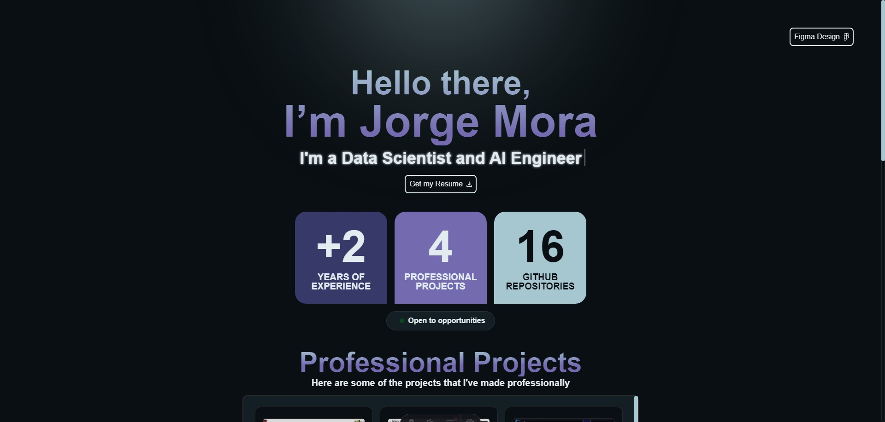

A **highly optimized personal portfolio** built with **Astro** and deployed on **Vercel**, designed with a focus on **performance, caching, and UI/UX optimization**. This portfolio delivers a fast, seamless, and visually appealing experience for visitors. 🚀  

## 🌟 Features  

### ⚡ **Blazing Fast Performance**  
- Optimized for the **lowest possible load time**, ensuring a smooth user experience.  

### 📦 **Efficient Caching Strategy**  
- Reduces **blob storage usage** on Vercel and minimizes requests to the **GitHub API**, improving efficiency and reducing costs.  

### 🎨 **UI/UX First Approach**  
- Designed in **Figma** before implementation, ensuring a clean, intuitive, and **developer-friendly layout**.  
- Focuses on **minimalism** and **informative design**, with effective use of **white space** and **typography**.  

### 💾 **Serverless & Edge Optimization**  
- Leverages **Vercel’s Edge Functions** for dynamic content delivery with **ultra-low latency**.  

### 🌀 **Smooth Animations**  
- Includes a **typing effect** and a highly optimized **tech icon carousel** for a delightful user experience.  

## 🚀 Deployment  

The portfolio is live and deployed on **Vercel**, utilizing:  
- ✅ **Static Site Generation (SSG)** for lightning-fast load times.  
- ✅ **Incremental Static Regeneration (ISR)** to efficiently update content.  
- ✅ **Edge Functions** for dynamic content delivery with minimal latency.  

## 🎨 UI/UX Philosophy  

The design follows a **minimalist yet informative** approach, ensuring:  
- A **clean and modern** layout tailored for developers.  
- Effective use of **white space** and **typography** for readability.  
- Smooth **animations and transitions** to enhance user engagement.  

## 🖼️ Portfolio Screenshot  

  

This project showcases the power of **Astro** and **Vercel** in building high-performance, visually appealing, and user-friendly web applications. Perfect for developers looking to create a standout portfolio! 💻✨