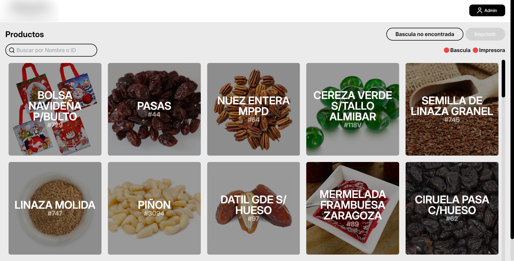
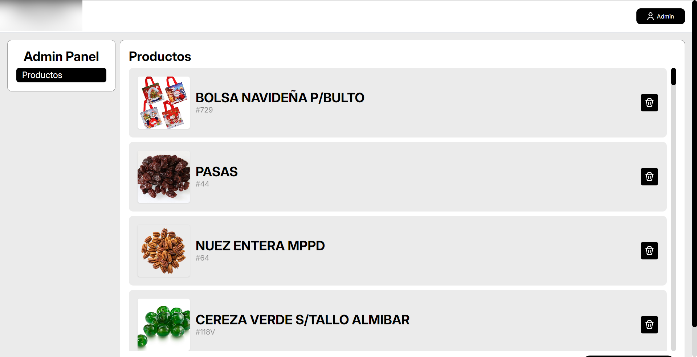

A **desktop application** designed to **streamline product labeling** in a **grocery store**, integrating **serial port communication** with a scale and a **DLL-based ticket printer interface**.  

  

## 🚀 **Features**  

### 💻 **Hardware Integration**  
- **Scale Communication**: Retrieves **real-time weight data** via **serial ports**.  
- **Ticket Printer Support**: Implements **DLL-based** communication for **seamless label printing**.  

### 🧑🏻‍💻 **Technical Implementation**  
- 🔍 **Reverse Engineering**:  
  - Due to the **lack of documentation**, the **official diagnostic tool** was decompiled to understand the printer’s **communication protocol**.  
- 🔄 **32-bit to 64-bit DLL Migration**:  
  - The original **32-bit DLL** was successfully **exported and adapted** for **64-bit environments**.  
- 🏷️ **TSPL Command Language**:  
  - Generates **dynamic labels** using **TSPL (TSC Printer Language)**, ensuring **flexible and customizable label designs**.  

  

### 📂 **Data Management**  
- 📄 **JSON-based Storage**:  
  - All **product and weight data** are stored efficiently in a **JSON file**, ensuring **lightweight and portable** data handling.  

  
