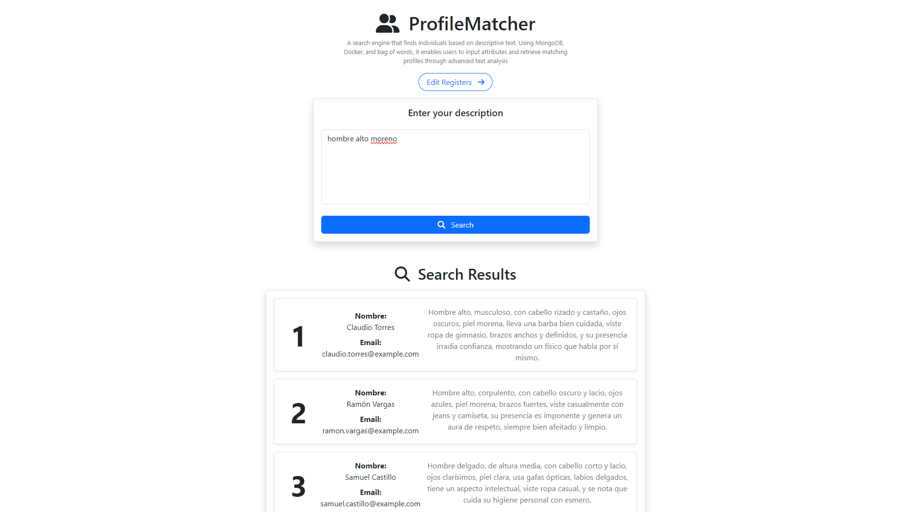
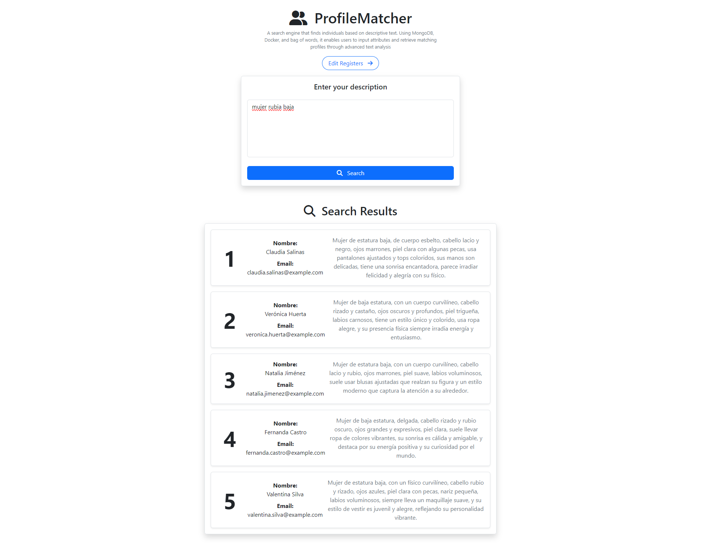

## Overview

**ProfileMatcher** is a powerful **semantic search engine** designed to find the best match between profiles using **Bag of Words** and **TF-IDF** techniques. It is built with **Node.js** and **Python**, orchestrated via **Docker** for seamless deployment and scalability.  

### **Key Components**  
- **Node.js** – Manages person descriptions (adding, deleting, updating records).  
- **Python** – Handles the search and ranking process, leveraging **natural language processing (NLP)** to determine relevant matches.  
- **Modular Architecture** – Two independent servers run separately for **Node.js** and **Python**, ensuring efficiency.  

## Preview

Take a look at **ProfileMatcher** in action:  

  
  

## How It Works

### **Search Request Flow**  
When a user submits a search query, the following process occurs:  

```plaintext
Search Request → Node.js Server → Python Server → Search Function → Return Response
```

### **Text Processing Pipeline**  
Before performing a search, text data undergoes a **preprocessing pipeline** to enhance accuracy:  

```plaintext
txt to lower → Remove special chars → Remove stop words → Spell check → Lemmatize → Replace synonyms → Stem
```

## Limitations & Considerations

### **Lemmatization Constraint**  
The project utilizes a **Spanish linguistic API**, obtained via **web scraping** from [Lenguaje.com](https://lenguaje.com). The specific API used is:  

🔗 [Lemmatizer API](https://lenguaje.com/wp-json/lemmatizer/v1/)  

⚠ Limitations:
- The API imposes a **request limit per hour**, which may hinder large-scale processing.  
- A potential workaround is using a **proxy server**, but this has **not been implemented** yet.  

## Future Improvements

🚀 Planned enhancements:  
- Develop a **custom lemmatization service** to eliminate reliance on external APIs.  
- Optimize search efficiency by integrating **word embeddings** or **semantic vector models**.  
- Expand support for **multiple languages** beyond Spanish.  