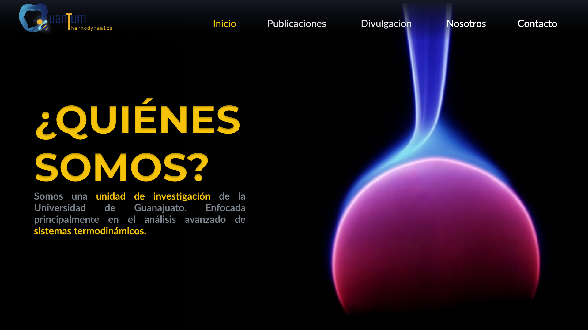
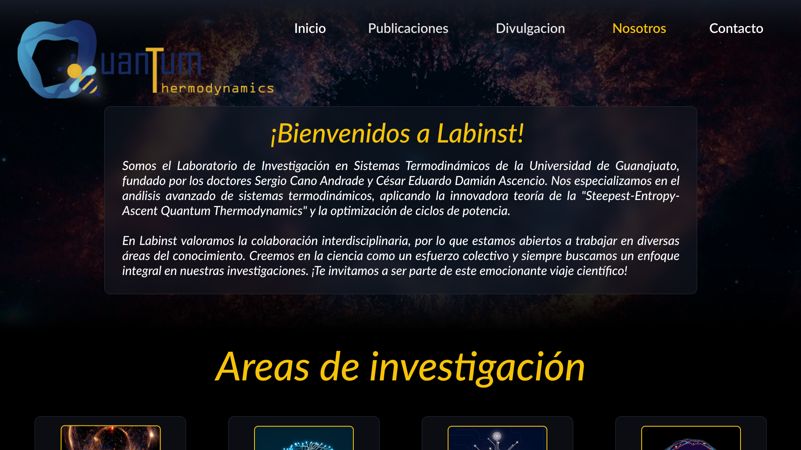
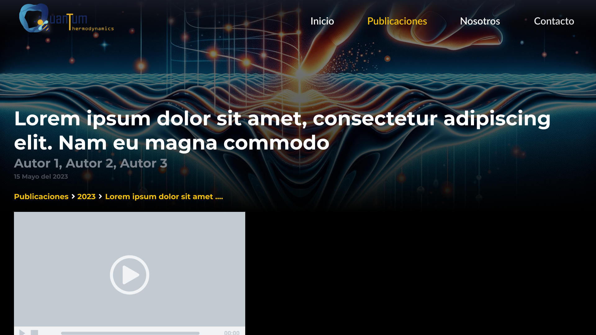

A **modern and minimalist** website developed for the **Thermodynamic Systems Laboratory** at the **University of Guanajuato**. The platform serves as a hub for **scientific dissemination**, showcasing the laboratory's **research, projects, and publications**.  

## 🎯 Objectives  

- **Science Communication**: Provide a public space to share **ongoing research** and **scientific achievements**.  
- **Paper & News Publication System**: Offer an easy-to-use **content management system (CMS)** for adding **research papers and articles**.  
- **Reader Engagement**: Implement a **newspaper-style update system** to keep **curious readers** informed with the latest developments.  

## 🖌️ UI/UX Design  

- **Designed in Figma** to achieve a **modern and minimalist** look, ensuring clarity and ease of navigation.  
- **User-centric approach** focusing on accessibility, readability, and an **intuitive layout** for researchers and visitors alike.  

## 🛠️ Technical Implementation  

- **Custom CMS Integration**: Developed a **secure and user-friendly** interface for laboratory members to publish **articles and research papers**.  
- **Newspaper System**: Implemented a **blog-style newsfeed** to keep the website updated with **recent findings and announcements**.  
- **Responsive Design**: Fully optimized for **desktop, tablet, and mobile devices**.  
- **Performance Optimization**: Ensured **fast loading times** using efficient caching mechanisms.  

## 🚀 Features  

- **Publication Management**: Researchers can upload and edit **scientific papers** and **articles**.  
- **Dynamic News Section**: Readers can stay up to date with the **latest research** and **lab activities**.  
- **Minimalist & Professional UI**: Ensuring a **clean and organized** interface.  
- **Admin Panel**: Allows authorized users to **manage content** effortlessly.  