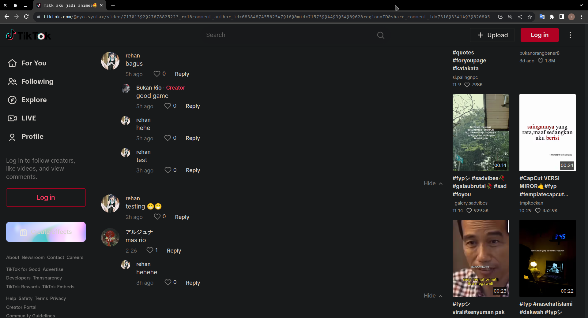

## What's New in This Fork 🚀

- **Asynchronous fetching** for faster and more efficient data retrieval ⚡
- **CSV output support** for convenient data management 📊
- **Fetch comments from multiple URLs or video IDs** in one go 🌍

## How It Works 🤖

This tool allows you to scrape comments from TikTok videos, enabling quick and easy extraction of comments and related metadata. Whether you're analyzing a viral video or collecting data for research, this scraper helps you collect comments with flexibility and speed. You can fetch data from **single** or **multiple TikTok video URLs/IDs** at once. 

Here’s how you can use the scraper to get the comments data:

### **Sample Output** 💬

Here’s a sneak peek at how the output will look after running the scraper. The output includes metadata like captions, usernames, avatars, comment timestamps, and even nested replies!

  

### **Example JSON Output** 📑

Here’s an example of the JSON output you can expect:

```json
{
  "caption": "makk aku jadi animee🤩#faceplay #faceplayapp #anime #harem #xysryo",
  "date_now": "2023-12-10T22:06:04",
  "video_url": "https://t.tiktok.com/i18n/share/video/7170139292767882522/?_d=0&comment_author_id=6838487455625479169&mid=7157599449395496962&preview_pb=0&region=ID&share_comment_id=7310977412674093829&share_item_id=7170139292767882522&sharer_language=en&source=h5_t&u_code=0",
  "comments": [
    {
      "username": "user760722966",
      "nickname": "rehan",
      "comment": "testing 😁😁",
      "create_time": "2023-12-10T21:46:36",
      "avatar": "https://p16-sign-useast2a.tiktokcdn.com/tos-useast2a-avt-0068-giso/f64f2c7df8a16098d3b3c80e958ffc52~c5_100x100.jpg?x-expires=1702306800&x-signature=KhUeuGmPAVij9A8gbgh7wK6rn98%3D",
      "total_reply": 0,
      "replies": []
    },
    {
      "username": "user760722966",
      "nickname": "rehan",
      "comment": "bagus",
      "create_time": "2023-12-10T18:55:47",
      "avatar": "https://p16-sign-useast2a.tiktokcdn.com/tos-useast2a-avt-0068-giso/f64f2c7df8a16098d3b3c80e958ffc52~c5_100x100.jpg?x-expires=1702306800&x-signature=KhUeuGmPAVij9A8gbgh7wK6rn98%3D",
      "total_reply": 3,
      "replies": [
        {
          "username": "ryo.syntax",
          "nickname": "Bukan Rio",
          "comment": "good game",
          "create_time": "2023-12-10T18:56:19",
          "avatar": "https://p16-sign-useast2a.tiktokcdn.com/tos-useast2a-avt-0068-giso/be4a9d0479f29d00cb3d06905ff5a972~c5_100x100.jpg?x-expires=1702306800&x-signature=IvkeSvXmvkmE0hZG5dtgpqcFn3A%3D"
        }
        // more replies
      ]
    }
    // more comments
  ]
}
```

## Why Use This Scraper? 💡

Whether you're conducting research, analyzing trends, or just curious about what TikTok users are saying, this scraper provides a fast, flexible, and straightforward way to collect the data you need.

- **Fast and Scalable** 🚀: Asynchronous fetching allows you to process multiple videos simultaneously, saving time.
- **Easy to Use** 👌: Simple flags and parameters to customize your data collection.
- **Flexible Output Options** 💾: Get your results in JSON or CSV format for easy manipulation.

## Perfect for Researchers and Data Enthusiasts 🔍

This tool was developed as part of a **research project** at the **University of Guanajuato**. It’s optimized to make collecting and analyzing TikTok comments as smooth as possible, perfect for anyone working with social media data!