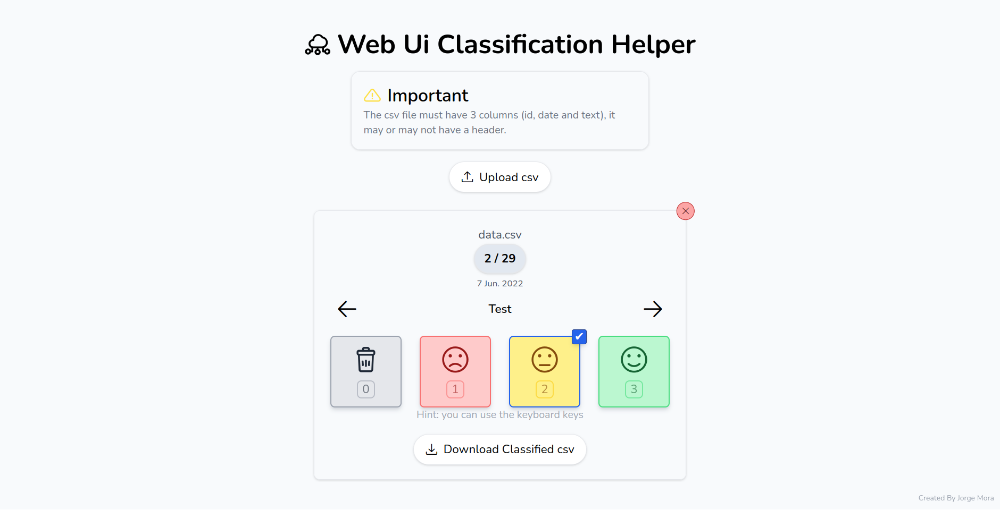
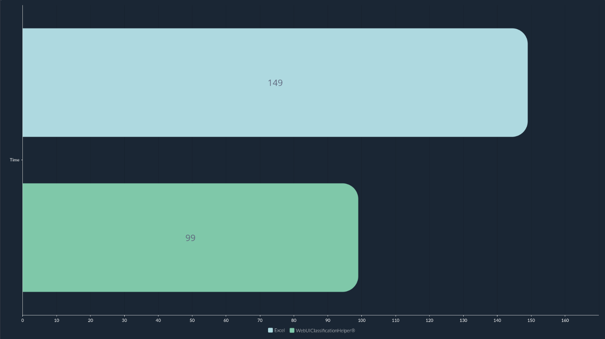

## General Description

This project consists of a web page developed using **HTML**, **CSS**, and **Vanilla JavaScript**. Its main objective is to allow users to efficiently classify **CSV datasets** with ease. 🚀  

The tool was created as part of a **research project** during the **Summer of Science** at the **University of Guanajuato**. It is designed to provide a **user-friendly** and **accessible interface**, simplifying the classification process without requiring advanced configurations or additional software. 💻📊



## How It Works

The program accepts an input CSV file with the following format:  

```csv
id, date, text
```

After processing the data, it generates an output file in this format:  

```csv
index, text, classification
```

The **classification system** was developed using **Bootstrap**, ensuring a modern, responsive visual experience. 📱✨ Additionally, the application runs entirely **client-side**, meaning **no server** is required for its operation. This approach boosts both speed ⚡ and **privacy** 🔒.

## Comparison with Excel

To assess the tool's efficiency, **comparative tests** were conducted against **Microsoft Excel**. These tests analyzed factors like **ease of use**, **classification speed**, and overall **user experience** when handling large datasets. 📊✅

