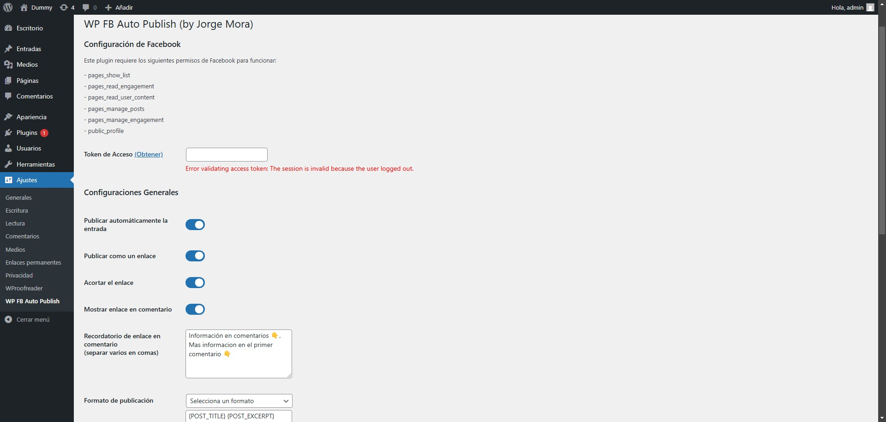
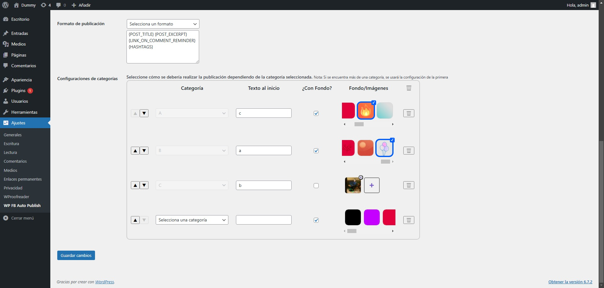

A **custom WordPress plugin** developed for a **news company**, enabling highly personalized **Facebook post publishing** directly from WordPress.  

## 🚀 Features  

### 📢 **Multiple Publishing Methods**  
The plugin supports different styles of publishing:  
✔ **Embedded Link**: Shares a post with a clickable preview.  
✔ **Colored Background**: Posts text updates with a custom background.  
✔ **Image Gallery**: Publishes multiple images as a carousel.  
✔ **Default Image**: Uses a predefined fallback image.  
✔ **Categories as Hashtags**: Automatically converts post categories into hashtags.  

### ⚡ **Smart Automation & Customization**  
The plugin includes several **automated actions** based on predefined conditions:  
✅ **Custom Backgrounds**: Assigns specific background colors for different categories.  
✅ **Image Commenting**: Adds a comment overlay to images when posting.  
✅ **Smart Cropping**: Automatically crops images for better appearance, especially when publishing 3 or an odd number of images.  
✅ **Link Shortening**: Trims long URLs for cleaner posts.  

### 🛠️ **Post Management & Monitoring**  
✔ **Deletion Detection**: Identifies if a Facebook post has been removed.  
✔ **Quick Actions**: Allows users to **delete or visit** a published post directly from the plugin interface.  

## 🏗️ How It Works  

1️⃣ The user selects an article from **WordPress**.  
2️⃣ The plugin formats the post based on the selected publishing method.  
3️⃣ Automation rules are applied (image cropping, link shortening, background, etc.).  
4️⃣ The post is published **directly to Facebook**.  
5️⃣ The plugin monitors post status (detecting deletions and allowing quick management).  

Once activated, you can configure it from the **WordPress Admin Panel**